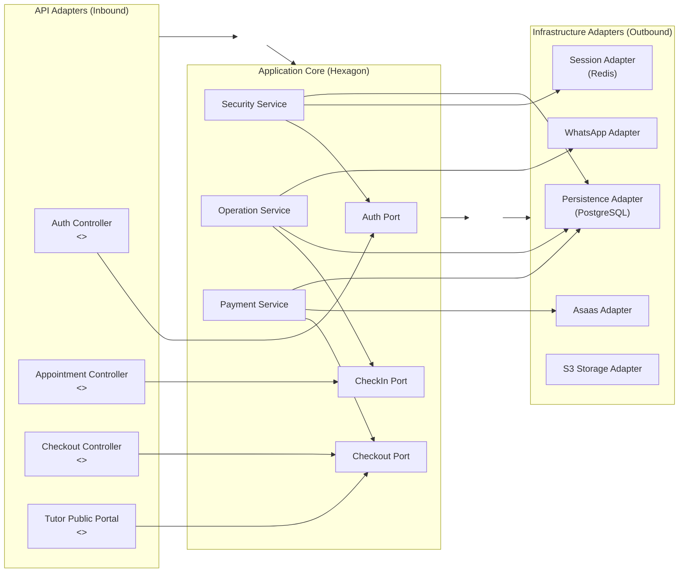

```mermaid
flowchart LR

%% ================
%% INBOUND
%% ================
subgraph INBOUND["API Adapters (Inbound)"]
direction TB
    AuthController["Auth Controller\n<<REST>>"]
    AppointmentController["Appointment Controller\n<<REST>>"]
    CheckoutController["Checkout Controller\n<<REST>>"]
    TutorPortal["Tutor Public Portal\n<<Web>>"]
end

%% espaçadores invisíveis (ajuda MUITO)
sp1[" "]:::spacer
sp2[" "]:::spacer

%% ================
%% CORE
%% ================
subgraph CORE["Application Core (Hexagon)"]
direction TB
    IAuth["Auth Port"]
    ICheck["CheckIn Port"]
    IPay["Checkout Port"]

    SecurityService["Security Service"]
    OperationService["Operation Service"]
    PaymentService["Payment Service"]

    SecurityService --> IAuth
    OperationService --> ICheck
    PaymentService --> IPay
end

%% ================
%% INFRA
%% ================
subgraph INFRA["Infrastructure Adapters (Outbound)"]
direction TB
    PersistenceAdapter["Persistence Adapter\n(PostgreSQL)"]
    SessionAdapter["Session Adapter\n(Redis)"]
    AsaasAdapter["Asaas Adapter"]
    WhatsAppAdapter["WhatsApp Adapter"]
    S3Adapter["S3 Storage Adapter"]
end

%% ================
%% ENTRE CAMADAS (colunas)
%% ================
INBOUND --> sp1 --> CORE --> sp2 --> INFRA

%% ================
%% RELACIONAMENTOS
%% ================
AuthController --> IAuth
AppointmentController --> ICheck
CheckoutController --> IPay
TutorPortal --> IPay

SecurityService --> SessionAdapter
SecurityService --> PersistenceAdapter

OperationService --> PersistenceAdapter
OperationService --> WhatsAppAdapter

PaymentService --> AsaasAdapter
PaymentService --> PersistenceAdapter

%% estilo dos espaçadores
classDef spacer fill:transparent,stroke:transparent,color:transparent;
```