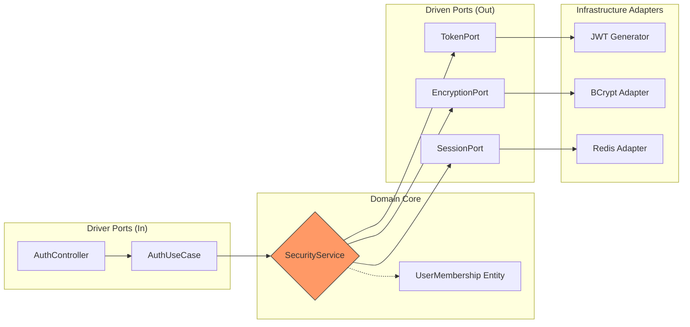

```mermaid
graph LR
    subgraph "Driver Ports (In)"
        A[AuthController] --> B[AuthUseCase]
    end

    subgraph "Domain Core"
        B --> C{SecurityService}
        C -.-> D[UserMembership Entity]
    end

    subgraph "Driven Ports (Out)"
        C --> E[TokenPort]
        C --> F[EncryptionPort]
        C --> G[SessionPort]
    end

    subgraph "Infrastructure Adapters"
        E --> E1[JWT Generator]
        F --> F1[BCrypt Adapter]
        G --> G1[Redis Adapter]
    end

    style C fill:#f96,stroke:#333
```