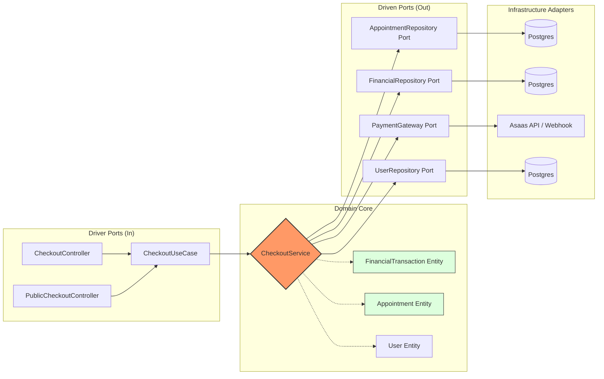

```mermaid

graph LR
    %% Porta de Entrada (Driver)
    subgraph "Driver Ports (In)"
        A[CheckoutController] --> B[CheckoutUseCase]
        A2[PublicCheckoutController] --> B
    end

    %% O Coração (Domain / Use Case)
    subgraph "Domain Core"
        B[CheckoutUseCase] --> C{CheckoutService}
        C -.-> D[FinancialTransaction Entity]
        C -.-> E[Appointment Entity]
        C -.-> J[User Entity]
    end

    %% Portas de Saída (Driven)
    subgraph "Driven Ports (Out)"
        C --> F[AppointmentRepository Port]
        C --> G[FinancialRepository Port]
        C --> H[PaymentGateway Port]
        C --> I[UserRepository Port]
    end

    %% Adaptadores (Implementação Real)
    subgraph "Infrastructure Adapters"
        F --> F1[(Postgres)]
        G --> G1[(Postgres)]
        H --> H1[Asaas API / Webhook]
        I --> I1[(Postgres)]
    end

    style C fill:#f96,stroke:#333,stroke-width:2px
    style D fill:#dfd,stroke:#333
    style E fill:#dfd,stroke:#333
```