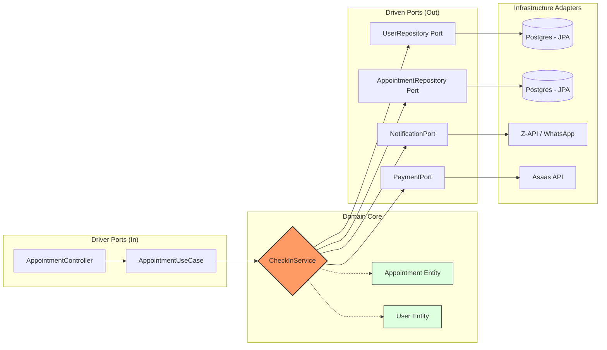

```mermaid
graph LR
    %% Porta de Entrada (Driver)
    subgraph "Driver Ports (In)"
        A[AppointmentController] --> B[AppointmentUseCase]
    end

    %% O Coração (Domain / Use Case)
    subgraph "Domain Core"
        B[AppointmentUseCase] --> C{CheckInService}
        C -.-> D[Appointment Entity]
        C -.-> E[User Entity]
    end

    %% Portas de Saída (Driven)
    subgraph "Driven Ports (Out)"
        C --> F[UserRepository Port]
        C --> G[AppointmentRepository Port]
        C --> H[NotificationPort]
        C --> I[PaymentPort]
    end

    %% Adaptadores (Implementação Real)
    subgraph "Infrastructure Adapters"
        F --> F1[(Postgres - JPA)]
        G --> G1[(Postgres - JPA)]
        H --> H1[Z-API / WhatsApp]
        I --> I1[Asaas API]
    end

    style C fill:#f96,stroke:#333,stroke-width:2px
    style D fill:#dfd,stroke:#333
    style E fill:#dfd,stroke:#333
```