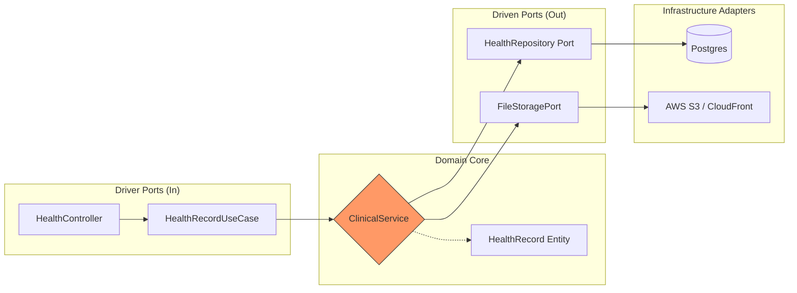

```mermaid
graph LR
    subgraph "Driver Ports (In)"
        H[HealthController] --> I[HealthRecordUseCase]
    end

    subgraph "Domain Core"
        I --> J{ClinicalService}
        J -.-> K[HealthRecord Entity]
    end

    subgraph "Driven Ports (Out)"
        J --> L[HealthRepository Port]
        J --> M[FileStoragePort]
    end

    subgraph "Infrastructure Adapters"
        L --> L1[(Postgres)]
        M --> M1[AWS S3 / CloudFront]
    end

    style J fill:#f96,stroke:#333
```