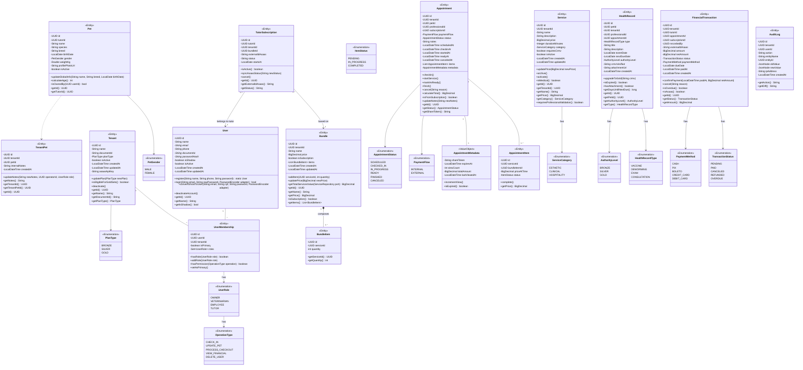

```mermaid
classDiagram
direction TB

class User {
    -UUID id
    -String name
    -String email*
    -String phone
    -String documentId*
    -String passwordHash*
    -boolean isShadow
    -boolean isActive
    -LocalDateTime createdAt
    -LocalDateTime updatedAt
    +register(String name, String phone, String password) static User
    +login(String email, String rawPassword, PasswordEncoder adapter) bool
    +convertGhostToUser(String email, String cpf, String password, PasswordEncoder adapter)
    +deactivateAccount()
    +getId() UUID
    +getName() String
    +getIsShadow() bool
}

class Tenant {
    <<Entity>>
    -UUID id
    -String name
    -String documentId
    -PlanType planType
    -boolean isActive
    -LocalDateTime createdAt
    -LocalDateTime updatedAt
    -String asaasApiKey
    +updatePlan(PlanType newPlan)
    +isEligibleForGoldSelo() boolean
    +deactivate()
    +getId() UUID
    +getName() String
    +getDocumentId() String
    +getPlanType() PlanType
}

class PlanType {
    <<Enumeration>>
    BRONZE
    SILVER
    GOLD
}

class UserMembership {
    <<Entity>>
    -UUID id
    -UUID userId
    -UUID tenantId
    -boolean isPrimary
    -Set~UserRole~ roles
    +hasRole(UserRole role) boolean
    +addRole(UserRole role)
    +hasPermission(OperationType operation) boolean
    +setAsPrimary()
}

class UserRole {
    <<Enumeration>>
    OWNER
    VETERINARIAN
    EMPLOYEE
    TUTOR
}

class OperationType {
    <<Enumeration>>
    CHECK_IN
    UPDATE_PET
    PROCESS_CHECKOUT
    VIEW_FINANCIAL
    DELETE_USER
}

User "1" -- "*" UserMembership
Tenant "1" -- "*" UserMembership
UserMembership --> UserRole : has
UserRole --> OperationType : has

class Pet {
    <<Entity>>
    -UUID id
    -UUID tutorId
    -String name
    -String species
    -String breed
    -LocalDate birthDate
    -PetGender gender
    -Double weightKg
    -String profilePhotoUrl
    -boolean isActive
    +updateGlobalInfo(String name, String breed, LocalDate birthDate)
    +calculateAge() int
    +isOwnedBy(UUID userId) bool
    +getId() UUID
    +getTutorId() UUID
}

class PetGender {
    <<Enumeration>>
    MALE
    FEMALE
}

class TenantPet {
    <<Entity>>
    -UUID id
    -UUID tenantId
    -UUID petId
    -String internalNotes
    -LocalDateTime createdAt
    +updateNotes(String newNotes, UUID operatorId, UserRole role)
    +getNotes() String
    +getTenantId() UUID
    +getTenantPetId() UUID
    +getId() UUID
}

Pet --> PetGender
Pet ..> TenantPet

Tenant --> PlanType

class Appointment {
    <<Entity>>
    -UUID id
    -UUID tenantId
    -UUID petId
    -UUID professionalId
    -UUID subscriptionId*
    -PaymentFlow paymentFlow
    -AppointmentStatus status
    -String notes
    -LocalDateTime scheduledAt
    -LocalDateTime checkinAt
    -LocalDateTime startedAt
    -LocalDateTime readyAt
    -LocalDateTime canceledAt
    -List~AppointmentItem~ items
    -AppointmentMetadata metadata
    +checkIn()
    +startService()
    +markAsReady()
    +finish()
    +cancel(String reason)
    +calculateTotal() BigDecimal
    +isFromSubscription() boolean
    +updateNotes(String newNotes)
    +getId() UUID
    +getStatus() AppointmentStatus
    +getShareToken() String
}

class AppointmentStatus {
    <<Enumeration>>
    SCHEDULED
    CHECKED_IN
    IN_PROGRESS
    READY
    FINISHED
    CANCELED
}

class AppointmentItem {
    <<Entity>>
    -UUID id
    -UUID serviceId
    -UUID bundleItemId*
    -BigDecimal priceAtTime
    -ItemStatus status
    +complete()
    +getPrice() BigDecimal
}

class AppointmentMetadata {
    <<ValueObject>>
    -String shareToken
    -LocalDateTime expiresAt
    -int viewCount
    -BigDecimal totalAmount
    -LocalDateTime lastViewedAt
    +incrementView()
    +isExpired() boolean
}

class PaymentFlow {
    <<Enumeration>>
    INTERNAL
    EXTERNAL
}

class ItemStatus {
    <<Enumeration>>
    PENDING
    IN_PROGRESS
    COMPLETED
}

Appointment "1" -- "1..*" AppointmentItem
Appointment "1" -- "1" AppointmentMetadata
Appointment --> PaymentFlow
Appointment --> AppointmentStatus

class Service {
    <<Entity>>
    -UUID id
    -UUID tenantId
    -String name
    -String description
    -BigDecimal price
    -Integer durationMinutes
    -ServiceCategory category
    -boolean requiresCrmv
    -boolean isActive
    -LocalDateTime createdAt
    -LocalDateTime updatedAt

    %% Métodos de Domínio
    +updatePrice(BigDecimal newPrice)
    +archive()
    +activate()
    +isMedical() boolean
    
    %% Getters de Estado
    +getId() UUID
    +getTenantId() UUID
    +getName() String
    +getPrice() BigDecimal
    +getCategory() ServiceCategory
    +requiresProfessionalValidation() boolean
}

class ServiceCategory {
    <<Enumeration>>
    ESTHETIC
    CLINICAL
    HOSPITALITY
}

Service --> ServiceCategory : has

class Bundle {
        <<Entity>>
        -UUID id
        -UUID tenantId
        -String name
        -BigDecimal price
        -boolean isSubscription
        -List~BundleItem~ items
        -LocalDateTime createdAt
        -LocalDateTime updatedAt

        %% Métodos de Domínio
        +addItem(UUID serviceId, int quantity)
        +updatePrice(BigDecimal newPrice)
        +getTotalServicesValue(ServiceRepository port) BigDecimal
        
        %% Getters
        +getId() UUID
        +getName() String
        +getPrice() BigDecimal
        +isSubscription() boolean
        +getItems() List~BundleItem~
    }

    class BundleItem {
        <<Entity>>
        -UUID id
        -UUID serviceId
        -int quantity
        
        +getServiceId() UUID
        +getQuantity() int
    }

    class TutorSubscription {
        <<Entity>>
        -UUID id
        -UUID tutorId
        -UUID tenantId
        -UUID bundleId
        -String externalIdAsaas
        -String status
        -LocalDate startsAt

        %% Métodos de Negócio
        +isActive() boolean
        +syncAsaasStatus(String newStatus)
        +cancel()
        
        %% Getters
        +getId() UUID
        +getExternalIdAsaas() String
        +getStatus() String
    }

    Bundle "1" *-- "1..*" BundleItem : composes
    TutorSubscription "0..*" --> "1" Bundle : based on
    TutorSubscription "0..*" --> "1" User : belongs to tutor

    class HealthRecord {
        <<Entity>>
        -UUID id
        -UUID petId
        -UUID tenantId
        -UUID professionalId
        -UUID appointmentId*
        -HealthRecordType type
        -String title
        -String description
        -LocalDate eventDate
        -LocalDate nextDueDate*
        -AuthorityLevel authorityLevel
        -String crmvVerified*
        -String attachmentUrl*
        -LocalDateTime createdAt
        
        %% Métodos de Domínio
        +upgradeToGold(String crmv)
        +isExpired() boolean
        +hasAttachment() boolean
        +getDaysUntilNextDue() long
        
        %% Getters de Estado
        +getId() UUID
        +getPetId() UUID
        +getAuthorityLevel() AuthorityLevel
        +getType() HealthRecordType
    }

    class HealthRecordType {
        <<Enumeration>>
        VACCINE
        DEWORMING
        EXAM
        CONSULTATION
    }

    class AuthorityLevel {
        <<Enumeration>>
        BRONZE
        SILVER
        GOLD
    }

    HealthRecord --> HealthRecordType : has
    HealthRecord --> AuthorityLevel : has

    class FinancialTransaction {
        <<Entity>>
        -UUID id
        -UUID tenantId
        -UUID tutorId
        -UUID appointmentId*
        -UUID subscriptionId*
        -UUID recordedBy*
        -String externalIdAsaas*
        -BigDecimal amount
        -BigDecimal netAmount*
        -TransactionStatus status
        -PaymentMethod paymentMethod
        -LocalDate dueDate
        -LocalDateTime paidAt
        -LocalDateTime createdAt

        %% Métodos de Domínio
        +confirmPayment(LocalDateTime paidAt, BigDecimal netAmount)
        +cancel(String reason)
        +isOverdue() boolean
        +isAsaas() boolean
        
        %% Getters de Estado
        +getId() UUID
        +getStatus() TransactionStatus
        +getAmount() BigDecimal
    }

    class AuditLog {
        <<Entity>>
        -UUID id
        -UUID tenantId
        -UUID userId
        -String action
        -String entityName
        -UUID entityId
        -JsonNode oldValue
        -JsonNode newValue
        -String ipAddress
        -LocalDateTime createdAt

        %% Getters
        +getAction() String
        +getDiff() String
    }

    class TransactionStatus {
        <<Enumeration>>
        PENDING
        PAID
        CANCELED
        REFUNDED
        OVERDUE
    }

    class PaymentMethod {
        <<Enumeration>>
        CASH
        PIX
        BOLETO
        CREDIT_CARD
        DEBIT_CARD
    }

    FinancialTransaction --> TransactionStatus : has
    FinancialTransaction --> PaymentMethod : has
```