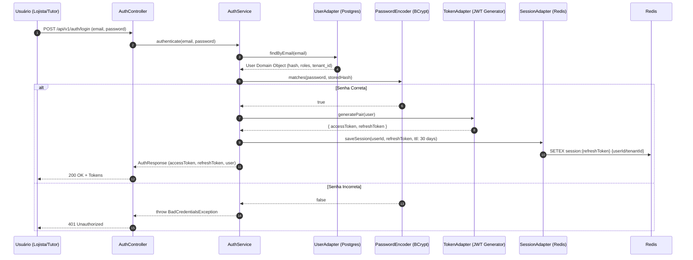

```mermaid
sequenceDiagram
    autonumber
    participant U as Usuário (Lojista/Tutor)
    participant C as AuthController
    participant S as AuthService
    participant UA as UserAdapter (Postgres)
    participant P as PasswordEncoder (BCrypt)
    participant TA as TokenAdapter (JWT Generator)
    participant SA as SessionAdapter (Redis)
    participant R as Redis

    U->>C: POST /api/v1/auth/login (email, password)
    C->>S: authenticate(email, password)
    
    S->>UA: findByEmail(email)
    UA-->>S: User Domain Object (hash, roles, tenant_id)
    
    S->>P: matches(password, storedHash)
    alt Senha Correta
        P-->>S: true
        
        S->>TA: generatePair(user)
        TA-->>S: { accessToken, refreshToken }
        
        S->>SA: saveSession(userId, refreshToken, ttl: 30 days)
        SA->>R: SETEX session:{refreshToken} {userId/tenantId}
        
        S-->>C: AuthResponse (accessToken, refreshToken, user)
        C-->>U: 200 OK + Tokens
    else Senha Incorreta
        P-->>S: false
        S-->>C: throw BadCredentialsException
        C-->>U: 401 Unauthorized
    end

```