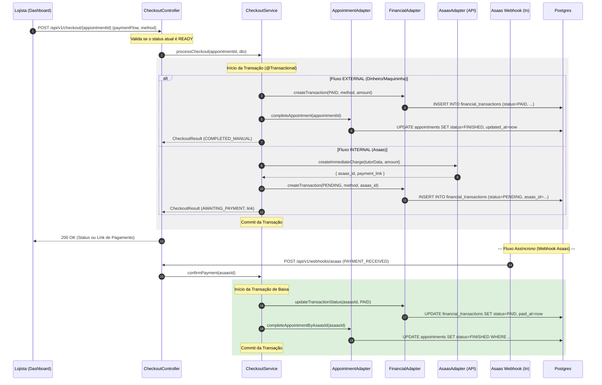
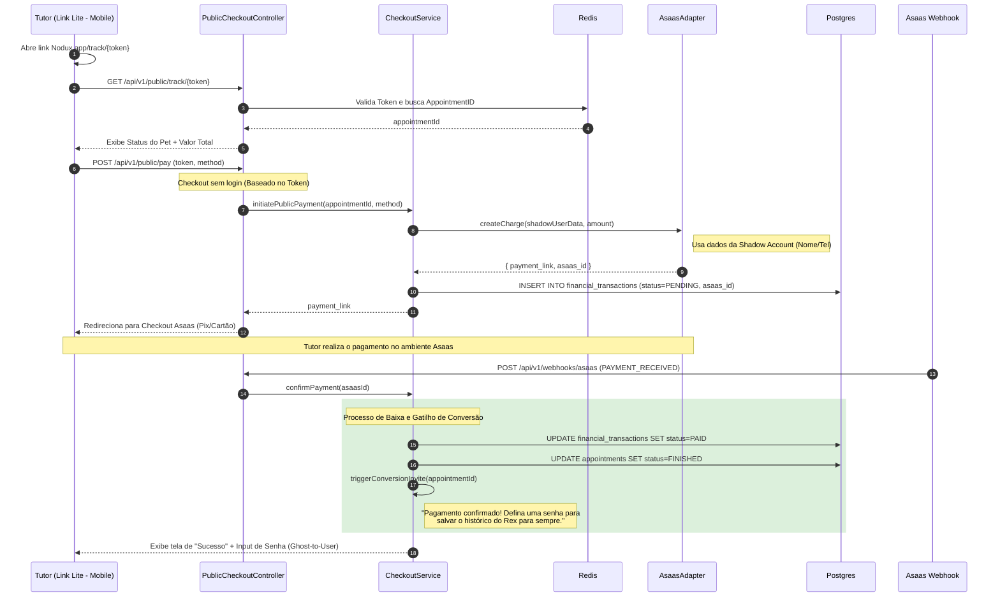

```mermaid
sequenceDiagram
    autonumber
    participant L as Lojista (Dashboard)
    participant C as CheckoutController
    participant S as CheckoutService
    participant AA as AppointmentAdapter
    participant FA as FinancialAdapter
    participant AsA as AsaasAdapter (API)
    participant WH as Asaas Webhook (In)
    participant DB as Postgres

    L->>C: POST /api/v1/checkout/{appointmentId} (paymentFlow, method)
    Note over C: Valida se o status atual é READY

    C->>S: processCheckout(appointmentId, dto)
    
    rect rgb(240, 240, 240)
    Note over S: Início da Transação (@Transactional)

    alt Fluxo EXTERNAL (Dinheiro/Maquininha)
        S->>FA: createTransaction(PAID, method, amount)
        FA->>DB: INSERT INTO financial_transactions (status=PAID, ...)
        S->>AA: completeAppointment(appointmentId)
        AA->>DB: UPDATE appointments SET status=FINISHED, updated_at=now
        S-->>C: CheckoutResult (COMPLETED_MANUAL)

    else Fluxo INTERNAL (Asaas)
        S->>AsA: createImmediateCharge(tutorData, amount)
        AsA-->>S: { asaas_id, payment_link }
        S->>FA: createTransaction(PENDING, method, asaas_id)
        FA->>DB: INSERT INTO financial_transactions (status=PENDING, asaas_id=...)
        S-->>C: CheckoutResult (AWAITING_PAYMENT, link)
    end
    Note over S: Commit da Transação
    end

    C-->>L: 200 OK (Status ou Link de Pagamento)

    Note over WH, DB: --- Fluxo Assíncrono (Webhook Asaas) ---
    
    WH->>C: POST /api/v1/webhooks/asaas (PAYMENT_RECEIVED)
    C->>S: confirmPayment(asaasId)
    
    rect rgb(220, 240, 220)
    Note over S: Início da Transação de Baixa
    S->>FA: updateTransactionStatus(asaasId, PAID)
    FA->>DB: UPDATE financial_transactions SET status=PAID, paid_at=now
    
    S->>AA: completeAppointmentByAsaasId(asaasId)
    AA->>DB: UPDATE appointments SET status=FINISHED WHERE ...
    Note over S: Commit da Transação
    end
```

# CHECKOUT USING LINK LITE (BUSINESS RULE)

```mermaid
sequenceDiagram
    autonumber
    participant T as Tutor (Link Lite - Mobile)
    participant C as PublicCheckoutController
    participant S as CheckoutService
    participant R as Redis
    participant AsA as AsaasAdapter
    participant DB as Postgres
    participant WH as Asaas Webhook

    T->>T: Abre link Nodux.app/track/{token}
    T->>C: GET /api/v1/public/track/{token}
    C->>R: Valida Token e busca AppointmentID
    R-->>C: appointmentId
    C-->>T: Exibe Status do Pet + Valor Total

    T->>C: POST /api/v1/public/pay (token, method)
    Note over C: Checkout sem login (Baseado no Token)

    C->>S: initiatePublicPayment(appointmentId, method)
    
    S->>AsA: createCharge(shadowUserData, amount)
    Note right of AsA: Usa dados da Shadow Account (Nome/Tel)
    AsA-->>S: { payment_link, asaas_id }

    S->>DB: INSERT INTO financial_transactions (status=PENDING, asaas_id)
    
    S-->>C: payment_link
    C-->>T: Redireciona para Checkout Asaas (Pix/Cartão)

    Note over T, AsA: Tutor realiza o pagamento no ambiente Asaas

    WH->>C: POST /api/v1/webhooks/asaas (PAYMENT_RECEIVED)
    C->>S: confirmPayment(asaasId)
    
    rect rgb(220, 240, 220)
    Note over S: Processo de Baixa e Gatilho de Conversão
    S->>DB: UPDATE financial_transactions SET status=PAID
    S->>DB: UPDATE appointments SET status=FINISHED
    
    S->>S: triggerConversionInvite(appointmentId)
    Note right of S: "Pagamento confirmado! Defina uma senha para<br/>salvar o histórico do Rex para sempre."
    end
    
    S-->>T: Exibe tela de "Sucesso" + Input de Senha (Ghost-to-User)
```