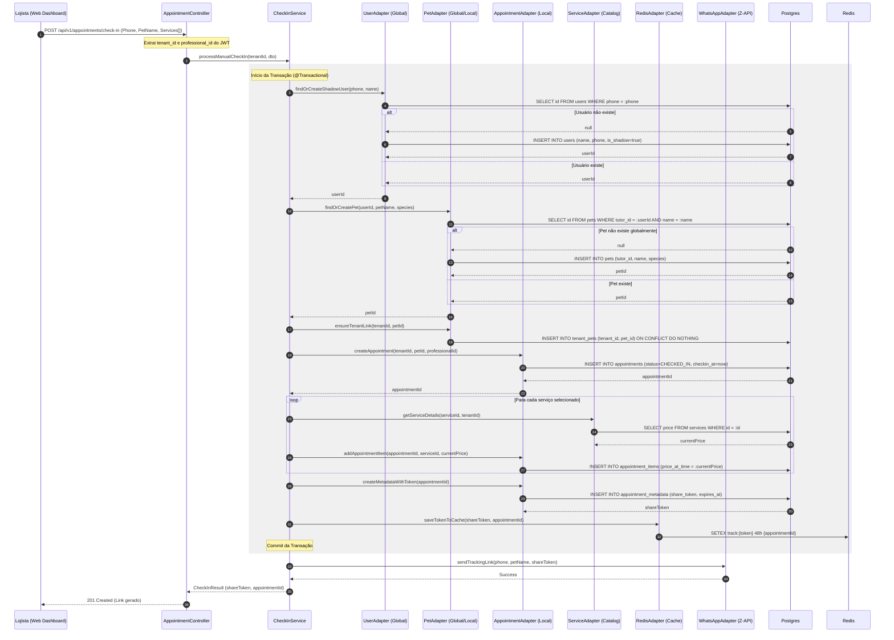

```mermaid
sequenceDiagram
    autonumber
    participant L as Lojista (Web Dashboard)
    participant C as AppointmentController
    participant S as CheckInService
    participant UA as UserAdapter (Global)
    participant PA as PetAdapter (Global/Local)
    participant AA as AppointmentAdapter (Local)
    participant SA as ServiceAdapter (Catalog)
    participant RA as RedisAdapter (Cache)
    participant WA as WhatsAppAdapter (Z-API)
    participant DB as Postgres

    L->>C: POST /api/v1/appointments/check-in (Phone, PetName, Services[])
    Note over C: Extrai tenant_id e professional_id do JWT

    C->>S: processManualCheckIn(tenantId, dto)
    
    rect rgb(240, 240, 240)
    Note over S: Início da Transação (@Transactional)

    %% 1. Gestão do Tutor (Shadow Account)
    S->>UA: findOrCreateShadowUser(phone, name)
    UA->>DB: SELECT id FROM users WHERE phone = :phone
    alt Usuário não existe
        DB-->>UA: null
        UA->>DB: INSERT INTO users (name, phone, is_shadow=true)
        DB-->>UA: userId
    else Usuário existe
        DB-->>UA: userId
    end
    UA-->>S: userId

    %% 2. Gestão do Pet (Soberania Global)
    S->>PA: findOrCreatePet(userId, petName, species)
    PA->>DB: SELECT id FROM pets WHERE tutor_id = :userId AND name = :name
    alt Pet não existe globalmente
        DB-->>PA: null
        PA->>DB: INSERT INTO pets (tutor_id, name, species)
        DB-->>PA: petId
    else Pet existe
        DB-->>PA: petId
    end
    PA-->>S: petId

    %% 3. Vínculo Local (Tenant_Pets)
    S->>PA: ensureTenantLink(tenantId, petId)
    PA->>DB: INSERT INTO tenant_pets (tenant_id, pet_id) ON CONFLICT DO NOTHING
    
    %% 4. Criação do Agendamento
    S->>AA: createAppointment(tenantId, petId, professionalId)
    AA->>DB: INSERT INTO appointments (status=CHECKED_IN, checkin_at=now)
    DB-->>AA: appointmentId
    AA-->>S: appointmentId

    %% 5. Itens e Preço Imutável
    loop Para cada serviço selecionado
        S->>SA: getServiceDetails(serviceId, tenantId)
        SA->>DB: SELECT price FROM services WHERE id = :id
        DB-->>SA: currentPrice
        S->>AA: addAppointmentItem(appointmentId, serviceId, currentPrice)
        AA->>DB: INSERT INTO appointment_items (price_at_time = :currentPrice)
    end

    %% 6. Metadados e Rastreio
    S->>AA: createMetadataWithToken(appointmentId)
    AA->>DB: INSERT INTO appointment_metadata (share_token, expires_at)
    DB-->>AA: shareToken
    
    S->>RA: saveTokenToCache(shareToken, appointmentId)
    RA->>Redis: SETEX track:{token} 48h {appointmentId}

    Note over S: Commit da Transação
    end

    %% 7. Notificação Outbound
    S->>WA: sendTrackingLink(phone, petName, shareToken)
    WA-->>S: Success

    S-->>C: CheckInResult (shareToken, appointmentId)
    C-->>L: 201 Created (Link gerado)
```