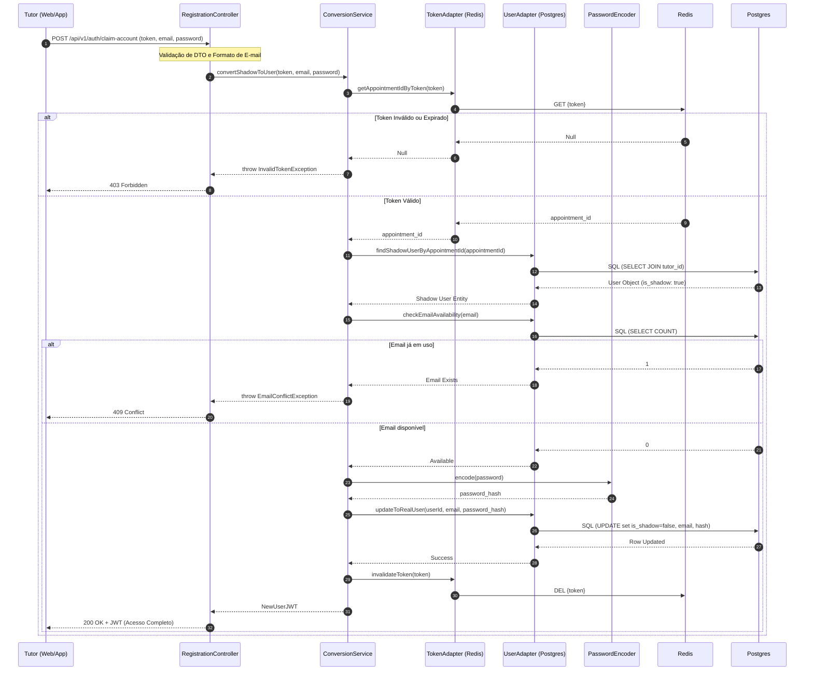

```mermaid
sequenceDiagram
    autonumber
    participant T as Tutor (Web/App)
    participant C as RegistrationController
    participant S as ConversionService
    participant TA as TokenAdapter (Redis)
    participant UA as UserAdapter (Postgres)
    participant P as PasswordEncoder
    participant R as Redis
    participant DB as Postgres

    T->>C: POST /api/v1/auth/claim-account (token, email, password)
    Note over C: Validação de DTO e Formato de E-mail

    C->>S: convertShadowToUser(token, email, password)
    
    S->>TA: getAppointmentIdByToken(token)
    TA->>R: GET {token}
    alt Token Inválido ou Expirado
        R-->>TA: Null
        TA-->>S: Null
        S-->>C: throw InvalidTokenException
        C-->>T: 403 Forbidden
    else Token Válido
        R-->>TA: appointment_id
        TA-->>S: appointment_id
        
        S->>UA: findShadowUserByAppointmentId(appointmentId)
        UA->>DB: SQL (SELECT JOIN tutor_id)
        DB-->>UA: User Object (is_shadow: true)
        UA-->>S: Shadow User Entity
        
        S->>UA: checkEmailAvailability(email)
        UA->>DB: SQL (SELECT COUNT)
        alt Email já em uso
            DB-->>UA: 1
            UA-->>S: Email Exists
            S-->>C: throw EmailConflictException
            C-->>T: 409 Conflict
        else Email disponível
            DB-->>UA: 0
            UA-->>S: Available
            
            S->>P: encode(password)
            P-->>S: password_hash
            
            S->>UA: updateToRealUser(userId, email, password_hash)
            UA->>DB: SQL (UPDATE set is_shadow=false, email, hash)
            DB-->>UA: Row Updated
            UA-->>S: Success
            
            S->>TA: invalidateToken(token)
            TA->>R: DEL {token}
            
            S-->>C: NewUserJWT
            C-->>T: 200 OK + JWT (Acesso Completo)
        end
    end
```