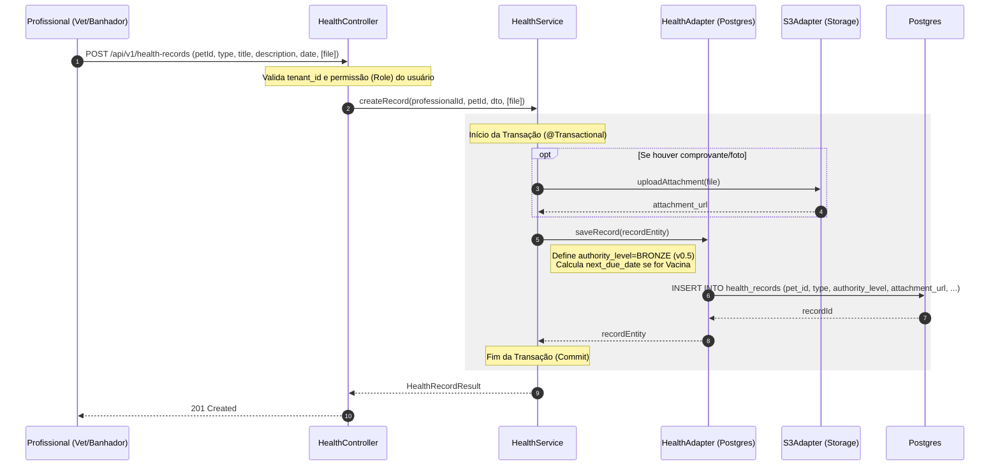
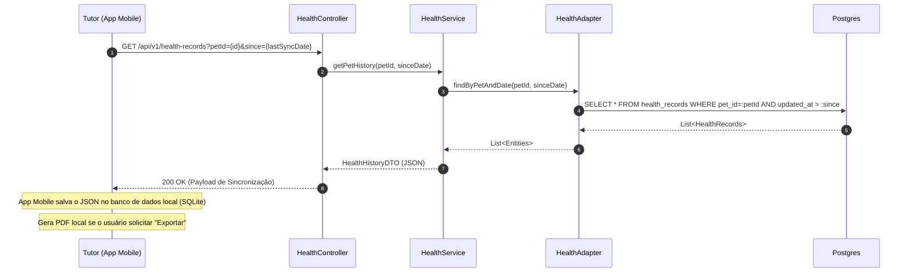

```mermaid
sequenceDiagram
    autonumber
    participant P as Profissional (Vet/Banhador)
    participant C as HealthController
    participant S as HealthService
    participant HA as HealthAdapter (Postgres)
    participant SA as S3Adapter (Storage)
    participant DB as Postgres

    P->>C: POST /api/v1/health-records (petId, type, title, description, date, [file])
    Note over C: Valida tenant_id e permissão (Role) do usuário

    C->>S: createRecord(professionalId, petId, dto, [file])
    
    rect rgb(240, 240, 240)
    Note over S: Início da Transação (@Transactional)
    
    opt Se houver comprovante/foto
        S->>SA: uploadAttachment(file)
        SA-->>S: attachment_url
    end

    S->>HA: saveRecord(recordEntity)
    Note right of S: Define authority_level=BRONZE (v0.5)<br/>Calcula next_due_date se for Vacina
    HA->>DB: INSERT INTO health_records (pet_id, type, authority_level, attachment_url, ...)
    DB-->>HA: recordId
    HA-->>S: recordEntity
    
    Note over S: Fim da Transação (Commit)
    end

    S-->>C: HealthRecordResult
    C-->>P: 201 Created
```

# Download to local device database

```mermaid
sequenceDiagram
    autonumber
    participant T as Tutor (App Mobile)
    participant C as HealthController
    participant S as HealthService
    participant HA as HealthAdapter
    participant DB as Postgres

    T->>C: GET /api/v1/health-records?petId={id}&since={lastSyncDate}
    C->>S: getPetHistory(petId, sinceDate)
    
    S->>HA: findByPetAndDate(petId, sinceDate)
    HA->>DB: SELECT * FROM health_records WHERE pet_id=:petId AND updated_at > :since
    DB-->>HA: List<HealthRecords>
    HA-->>S: List<Entities>
    
    S-->>C: HealthHistoryDTO (JSON)
    C-->>T: 200 OK (Payload de Sincronização)
    
    Note over T: App Mobile salva o JSON no banco de dados local (SQLite)
    Note over T: Gera PDF local se o usuário solicitar "Exportar"

```