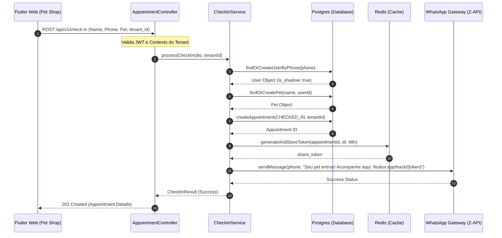

```mermaid
sequenceDiagram
    autonumber
    participant F as Flutter Web (Pet Shop)
    participant C as AppointmentController
    participant S as CheckInService
    participant DB as Postgres (Database)
    participant R as Redis (Cache)
    participant W as WhatsApp Gateway (Z-API)

    F->>C: POST /api/v1/check-in (Name, Phone, Pet, tenant_id)
    Note over C: Valida JWT e Contexto do Tenant
    C->>S: processCheckIn(dto, tenantId)
    
    S->>DB: findOrCreateUserByPhone(phone)
    DB-->>S: User Object (is_shadow: true)
    
    S->>DB: findOrCreatePet(name, userId)
    DB-->>S: Pet Object
    
    S->>DB: createAppointment(CHECKED_IN, tenantId)
    DB-->>S: Appointment ID
    
    S->>R: generateAndStoreToken(appointmentId, ttl: 48h)
    R-->>S: share_token

    S->>W: sendMessage(phone, "Seu pet entrou! Acompanhe aqui: Nodux.app/track/{token}")
    W-->>S: Success Status
    
    S-->>C: CheckInResult (Success)
    C-->>F: 201 Created (Appointment Details)
```