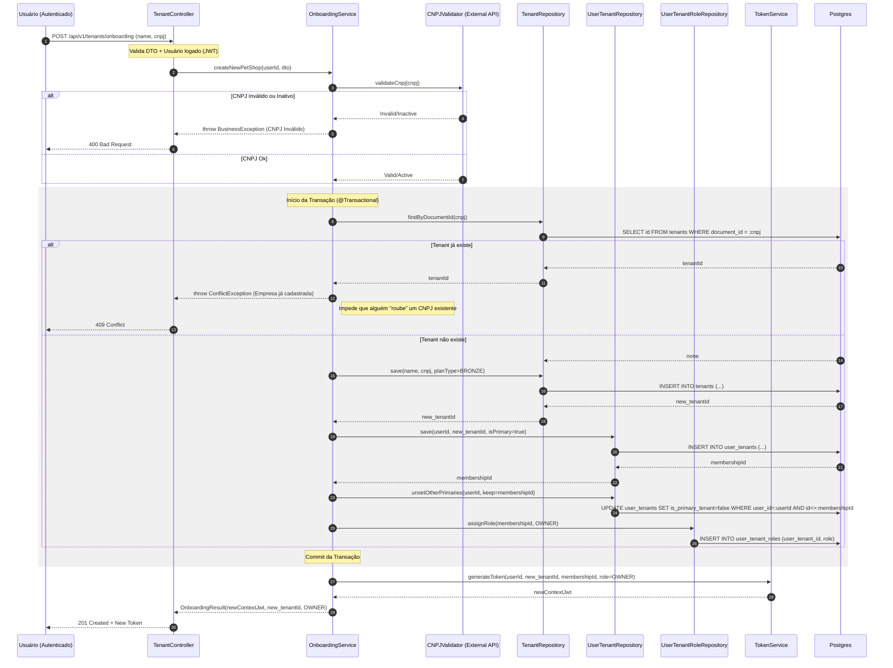

```mermaid
sequenceDiagram
    autonumber
    participant O as Usuário (Autenticado)
    participant C as TenantController
    participant S as OnboardingService
    participant V as CNPJValidator (External API)
    participant TA as TenantRepository
    participant MA as UserTenantRepository
    participant RA as UserTenantRoleRepository
    participant TokS as TokenService
    participant DB as Postgres

    O->>C: POST /api/v1/tenants/onboarding (name, cnpj)
    Note over C: Valida DTO + Usuário logado (JWT)

    C->>S: createNewPetShop(userId, dto)
    
    %% Validação Anti-Fraude
    S->>V: validateCnpj(cnpj)
    alt CNPJ Inválido ou Inativo
        V-->>S: Invalid/Inactive
        S-->>C: throw BusinessException (CNPJ Inválido)
        C-->>O: 400 Bad Request
    else CNPJ Ok
        V-->>S: Valid/Active
    end

    rect rgb(240,240,240)
    Note over S: Início da Transação (@Transactional)

    %% 1. Verificação de Conflito (Idempotência e Segurança)
    S->>TA: findByDocumentId(cnpj)
    TA->>DB: SELECT id FROM tenants WHERE document_id = :cnpj
    
    alt Tenant já existe
        DB-->>TA: tenantId
        TA-->>S: tenantId
        S-->>C: throw ConflictException (Empresa já cadastrada)
        Note right of S: Impede que alguém "roube" um CNPJ existente
        C-->>O: 409 Conflict
    else Tenant não existe
        DB-->>TA: none
        
        %% 2. Criação do Tenant
        S->>TA: save(name, cnpj, planType=BRONZE)
        TA->>DB: INSERT INTO tenants (...)
        DB-->>TA: new_tenantId
        TA-->>S: new_tenantId

        %% 3. Criação do vínculo (Membership)
        S->>MA: save(userId, new_tenantId, isPrimary=true)
        MA->>DB: INSERT INTO user_tenants (...)
        DB-->>MA: membershipId
        MA-->>S: membershipId
        
        %% 4. Garante apenas 1 primary por usuário
        S->>MA: unsetOtherPrimaries(userId, keep=membershipId)
        MA->>DB: UPDATE user_tenants SET is_primary_tenant=false WHERE user_id=:userId AND id<>:membershipId

        %% 5. Atribui papel OWNER (Qualquer usuário pode criar, mas quem cria é o Dono)
        S->>RA: assignRole(membershipId, OWNER)
        RA->>DB: INSERT INTO user_tenant_roles (user_tenant_id, role)
    end

    Note over S: Commit da Transação
    end

    %% 6. Geração do novo JWT contextual
    S->>TokS: generateToken(userId, new_tenantId, membershipId, role=OWNER)
    TokS-->>S: newContextJwt

    S-->>C: OnboardingResult(newContextJwt, new_tenantId, OWNER)
    C-->>O: 201 Created + New Token

```