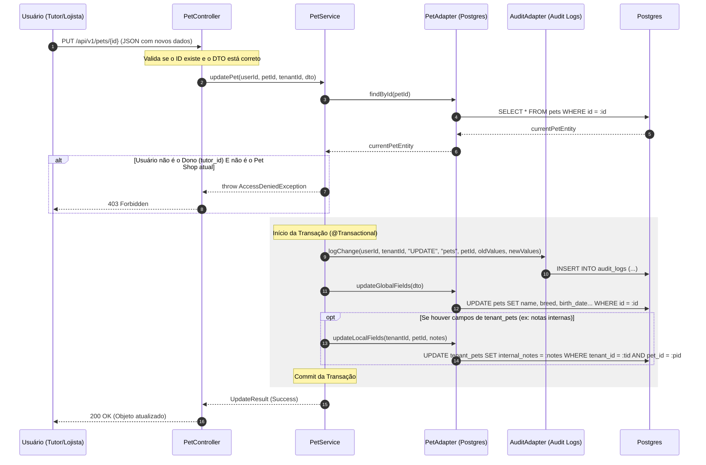

```mermaid
sequenceDiagram
    autonumber
    participant U as Usuário (Tutor/Lojista)
    participant C as PetController
    participant S as PetService
    participant PA as PetAdapter (Postgres)
    participant AA as AuditAdapter (Audit Logs)
    participant DB as Postgres

    U->>C: PUT /api/v1/pets/{id} (JSON com novos dados)
    Note over C: Valida se o ID existe e o DTO está correto

    C->>S: updatePet(userId, petId, tenantId, dto)
    
    S->>PA: findById(petId)
    PA->>DB: SELECT * FROM pets WHERE id = :id
    DB-->>PA: currentPetEntity
    PA-->>S: currentPetEntity

    %% Validação de Soberania
    alt Usuário não é o Dono (tutor_id) E não é o Pet Shop atual
        S-->>C: throw AccessDeniedException
        C-->>U: 403 Forbidden
    end

    rect rgb(240, 240, 240)
    Note over S: Início da Transação (@Transactional)

    %% Registro de Auditoria antes da mudança
    S->>AA: logChange(userId, tenantId, "UPDATE", "pets", petId, oldValues, newValues)
    AA->>DB: INSERT INTO audit_logs (...)

    %% Persistência dos Dados Globais
    S->>PA: updateGlobalFields(dto)
    PA->>DB: UPDATE pets SET name, breed, birth_date... WHERE id = :id

    %% Persistência dos Dados Locais (se houver)
    opt Se houver campos de tenant_pets (ex: notas internas)
        S->>PA: updateLocalFields(tenantId, petId, notes)
        PA->>DB: UPDATE tenant_pets SET internal_notes = :notes WHERE tenant_id = :tid AND pet_id = :pid
    end

    Note over S: Commit da Transação
    end

    S-->>C: UpdateResult (Success)
    C-->>U: 200 OK (Objeto atualizado)
```