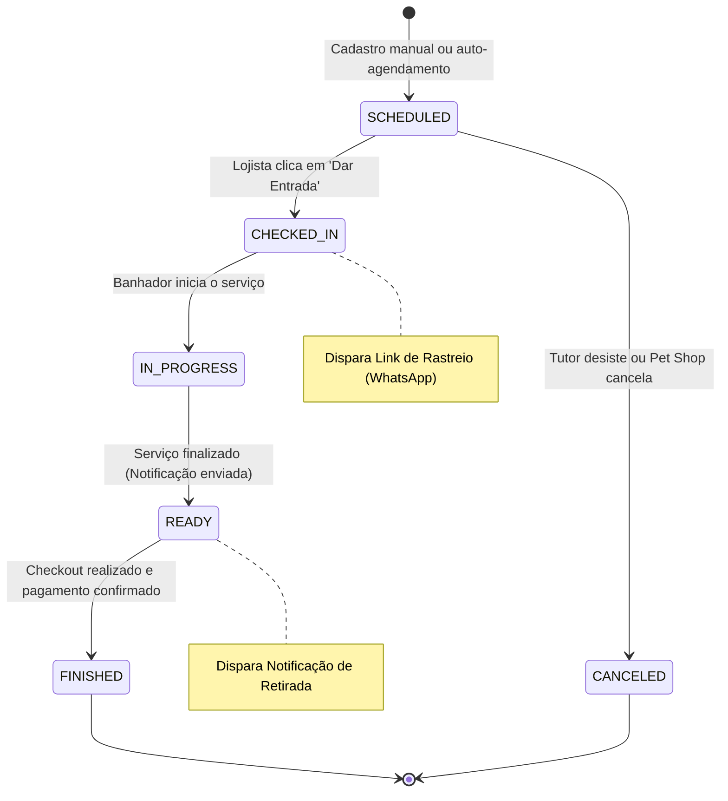

```mermaid
stateDiagram-v2
    [*] --> SCHEDULED : Cadastro manual ou auto-agendamento
    
    SCHEDULED --> CHECKED_IN : Lojista clica em 'Dar Entrada'
    SCHEDULED --> CANCELED : Tutor desiste ou Pet Shop cancela
    
    CHECKED_IN --> IN_PROGRESS : Banhador inicia o serviço
    
    IN_PROGRESS --> READY : Serviço finalizado (Notificação enviada)
    
    READY --> FINISHED : Checkout realizado e pagamento confirmado
    
    CANCELED --> [*]
    FINISHED --> [*]

    note right of CHECKED_IN : Dispara Link de Rastreio (WhatsApp)
    note right of READY : Dispara Notificação de Retirada
```