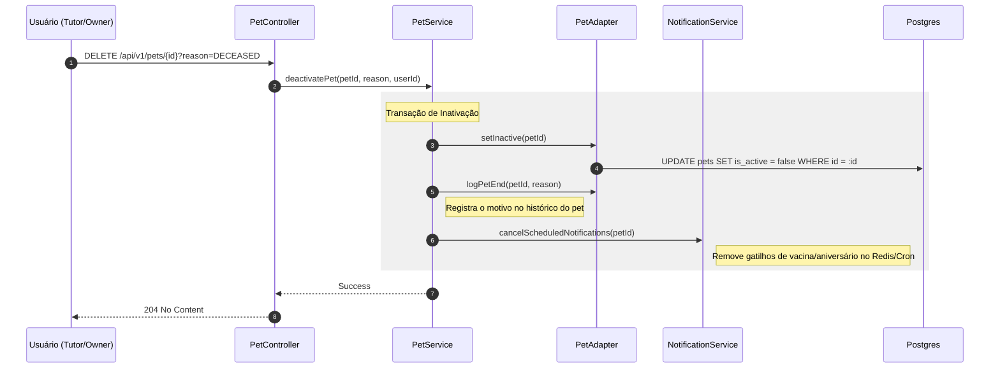

```mermaid
sequenceDiagram
    autonumber
    participant U as Usuário (Tutor/Owner)
    participant C as PetController
    participant S as PetService
    participant PA as PetAdapter
    participant NS as NotificationService
    participant DB as Postgres

    U->>C: DELETE /api/v1/pets/{id}?reason=DECEASED
    
    C->>S: deactivatePet(petId, reason, userId)
    
    rect rgb(240, 240, 240)
    Note over S: Transação de Inativação
    S->>PA: setInactive(petId)
    PA->>DB: UPDATE pets SET is_active = false WHERE id = :id
    
    S->>PA: logPetEnd(petId, reason)
    Note right of S: Registra o motivo no histórico do pet
    
    S->>NS: cancelScheduledNotifications(petId)
    Note right of NS: Remove gatilhos de vacina/aniversário no Redis/Cron
    end

    S-->>C: Success
    C-->>U: 204 No Content
```