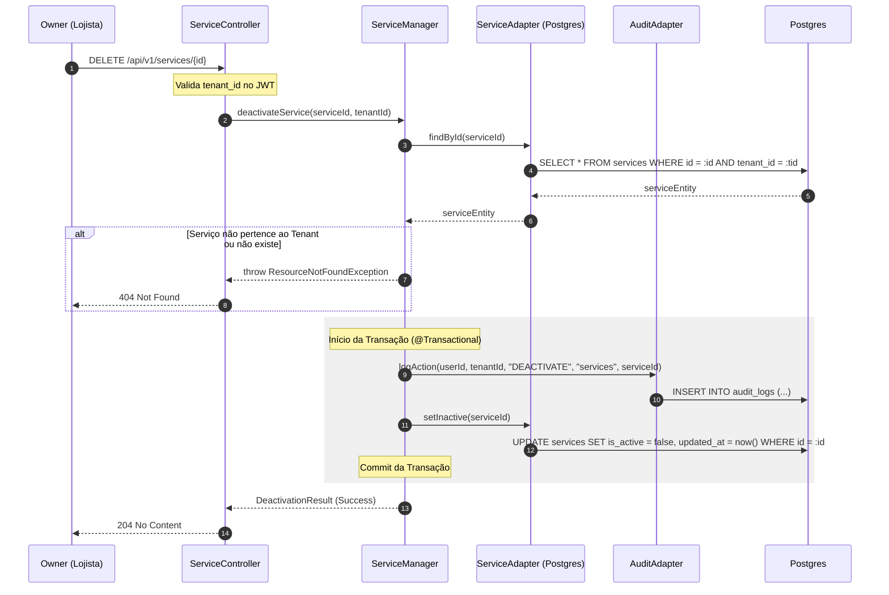

```mermaid
sequenceDiagram
    autonumber
    participant O as Owner (Lojista)
    participant C as ServiceController
    participant S as ServiceManager
    participant SA as ServiceAdapter (Postgres)
    participant AA as AuditAdapter
    participant DB as Postgres

    O->>C: DELETE /api/v1/services/{id}
    Note over C: Valida tenant_id no JWT

    C->>S: deactivateService(serviceId, tenantId)
    
    S->>SA: findById(serviceId)
    SA->>DB: SELECT * FROM services WHERE id = :id AND tenant_id = :tid
    DB-->>SA: serviceEntity
    SA-->>S: serviceEntity

    alt Serviço não pertence ao Tenant ou não existe
        S-->>C: throw ResourceNotFoundException
        C-->>O: 404 Not Found
    end

    rect rgb(240, 240, 240)
    Note over S: Início da Transação (@Transactional)

    %% Registro de Auditoria
    S->>AA: logAction(userId, tenantId, "DEACTIVATE", "services", serviceId)
    AA->>DB: INSERT INTO audit_logs (...)

    %% Soft Delete
    S->>SA: setInactive(serviceId)
    SA->>DB: UPDATE services SET is_active = false, updated_at = now() WHERE id = :id
    
    Note over S: Commit da Transação
    end

    S-->>C: DeactivationResult (Success)
    C-->>O: 204 No Content
```