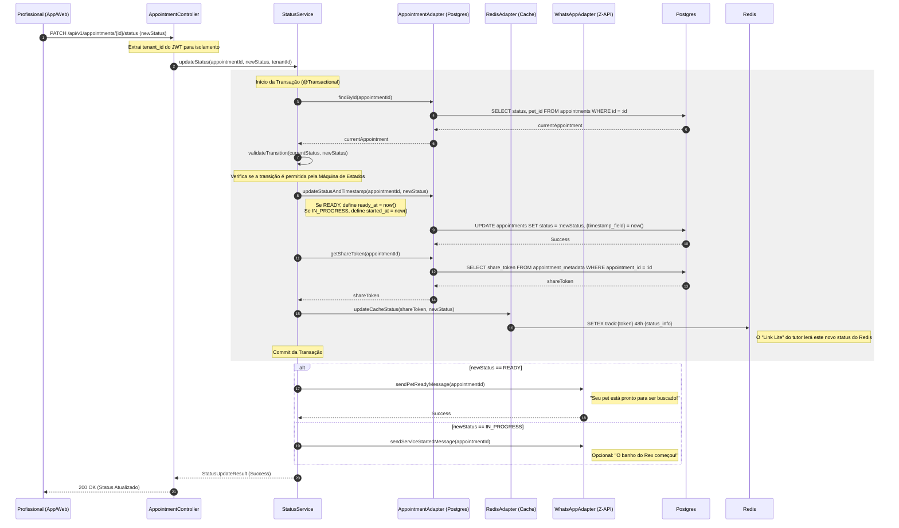

```mermaid
sequenceDiagram
    autonumber
    participant P as Profissional (App/Web)
    participant C as AppointmentController
    participant S as StatusService
    participant AA as AppointmentAdapter (Postgres)
    participant RA as RedisAdapter (Cache)
    participant WA as WhatsAppAdapter (Z-API)
    participant DB as Postgres
    participant R as Redis

    P->>C: PATCH /api/v1/appointments/{id}/status (newStatus)
    Note over C: Extrai tenant_id do JWT para isolamento

    C->>S: updateStatus(appointmentId, newStatus, tenantId)

    rect rgb(240, 240, 240)
    Note over S: Início da Transação (@Transactional)

    %% 1. Validação de Regra de Negócio
    S->>AA: findById(appointmentId)
    AA->>DB: SELECT status, pet_id FROM appointments WHERE id = :id
    DB-->>AA: currentAppointment
    AA-->>S: currentAppointment

    S->>S: validateTransition(currentStatus, newStatus)
    Note over S: Verifica se a transição é permitida pela Máquina de Estados

    %% 2. Persistência e Timestamps
    S->>AA: updateStatusAndTimestamp(appointmentId, newStatus)
    Note right of S: Se READY, define ready_at = now()<br/>Se IN_PROGRESS, define started_at = now()
    AA->>DB: UPDATE appointments SET status = :newStatus, {timestamp_field} = now()
    DB-->>AA: Success

    %% 3. Invalidação/Atualização de Cache
    S->>AA: getShareToken(appointmentId)
    AA->>DB: SELECT share_token FROM appointment_metadata WHERE appointment_id = :id
    DB-->>AA: shareToken
    AA-->>S: shareToken

    S->>RA: updateCacheStatus(shareToken, newStatus)
    RA->>R: SETEX track:{token} 48h {status_info}
    Note right of R: O "Link Lite" do tutor lerá este novo status do Redis

    Note over S: Commit da Transação
    end

    %% 4. Notificação Ativa (Apenas em estados críticos)
    alt newStatus == READY
        S->>WA: sendPetReadyMessage(appointmentId)
        Note right of WA: "Seu pet está pronto para ser buscado!"
        WA-->>S: Success
    else newStatus == IN_PROGRESS
        S->>WA: sendServiceStartedMessage(appointmentId)
        Note right of WA: Opcional: "O banho do Rex começou!"
    end

    S-->>C: StatusUpdateResult (Success)
    C-->>P: 200 OK (Status Atualizado)
```