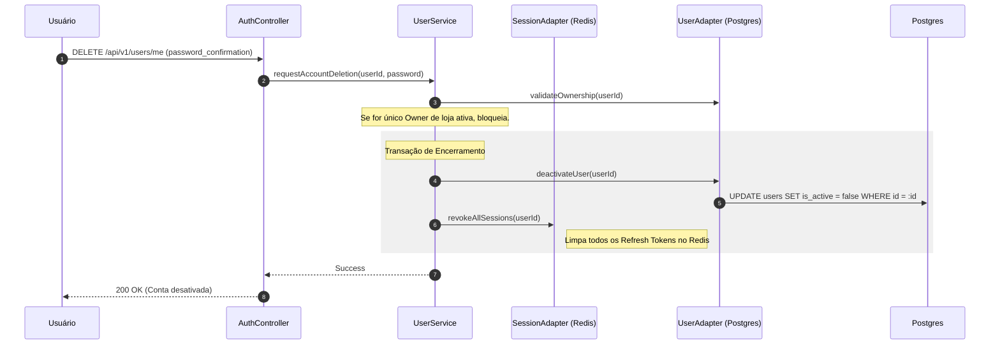

```mermaid
sequenceDiagram
    autonumber
    participant U as Usuário
    participant C as AuthController
    participant S as UserService
    participant SA as SessionAdapter (Redis)
    participant UA as UserAdapter (Postgres)
    participant DB as Postgres

    U->>C: DELETE /api/v1/users/me (password_confirmation)
    
    C->>S: requestAccountDeletion(userId, password)
    
    S->>UA: validateOwnership(userId)
    Note over S: Se for único Owner de loja ativa, bloqueia.
    
    rect rgb(240, 240, 240)
    Note over S: Transação de Encerramento
    S->>UA: deactivateUser(userId)
    UA->>DB: UPDATE users SET is_active = false WHERE id = :id
    
    S->>SA: revokeAllSessions(userId)
    Note right of SA: Limpa todos os Refresh Tokens no Redis
    end

    S-->>C: Success
    C-->>U: 200 OK (Conta desativada)
```