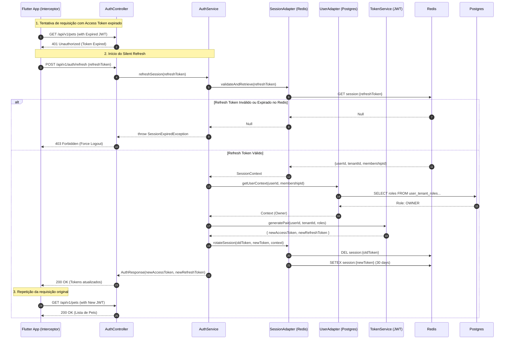

```mermaid
sequenceDiagram
    autonumber
    participant F as Flutter App (Interceptor)
    participant C as AuthController
    participant S as AuthService
    participant SA as SessionAdapter (Redis)
    participant UA as UserAdapter (Postgres)
    participant TS as TokenService (JWT)
    participant R as Redis
    participant DB as Postgres

    Note over F, C: 1. Tentativa de requisição com Access Token expirado
    F->>C: GET /api/v1/pets (with Expired JWT)
    C-->>F: 401 Unauthorized (Token Expired)

    Note over F, S: 2. Início do Silent Refresh
    F->>C: POST /api/v1/auth/refresh (refreshToken)
    C->>S: refreshSession(refreshToken)
    
    S->>SA: validateAndRetrieve(refreshToken)
    SA->>R: GET session:{refreshToken}
    
    alt Refresh Token Inválido ou Expirado no Redis
        R-->>SA: Null
        SA-->>S: Null
        S-->>C: throw SessionExpiredException
        C-->>F: 403 Forbidden (Force Logout)
    else Refresh Token Válido
        R-->>SA: {userId, tenantId, membershipId}
        SA-->>S: SessionContext
        
        %% Opcional: Busca roles atualizadas se necessário
        S->>UA: getUserContext(userId, membershipId)
        UA->>DB: SELECT roles FROM user_tenant_roles...
        DB-->>UA: Role: OWNER
        UA-->>S: Context (Owner)

        S->>TS: generatePair(userId, tenantId, roles)
        TS-->>S: { newAccessToken, newRefreshToken }

        %% Rotação de Refresh Token (Segurança Máxima)
        S->>SA: rotateSession(oldToken, newToken, context)
        SA->>R: DEL session:{oldToken}
        SA->>R: SETEX session:{newToken} (30 days)

        S-->>C: AuthResponse(newAccessToken, newRefreshToken)
        C-->>F: 200 OK (Tokens atualizados)
        
        Note over F: 3. Repetição da requisição original
        F->>C: GET /api/v1/pets (with New JWT)
        C-->>F: 200 OK (Lista de Pets)
    end
```