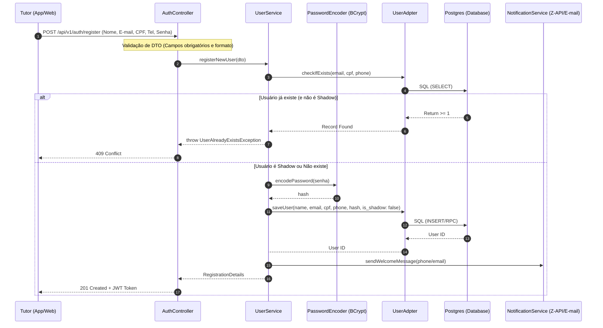

```mermaid
sequenceDiagram
    autonumber
    participant T as Tutor (App/Web)
    participant C as AuthController
    participant S as UserService
    participant P as PasswordEncoder (BCrypt)
    participant A as UserAdpter
    participant DB as Postgres (Database)
    participant N as NotificationService (Z-API/E-mail)

    T->>C: POST /api/v1/auth/register (Nome, E-mail, CPF, Tel, Senha)
    Note over C: Validação de DTO (Campos obrigatórios e formato)
    
    C->>S: registerNewUser(dto)
    
    S->>A: checkIfExists(email, cpf, phone)
    A->>DB: SQL (SELECT)
    alt Usuário já existe (e não é Shadow)
        DB-->>A: Return >= 1
        A-->>S: Record Found
        S-->>C: throw UserAlreadyExistsException
        C-->>T: 409 Conflict
    else Usuário é Shadow ou Não existe
        S->>P: encodePassword(senha)
        P-->>S: hash
        
        S->>A: saveUser(name, email, cpf, phone, hash, is_shadow: false)
        A->>DB: SQL (INSERT/RPC)
        DB-->>A: User ID
        A-->S: User ID
        
        S->>N: sendWelcomeMessage(phone/email)
        
        S-->>C: RegistrationDetails
        C-->>T: 201 Created + JWT Token
    end
```